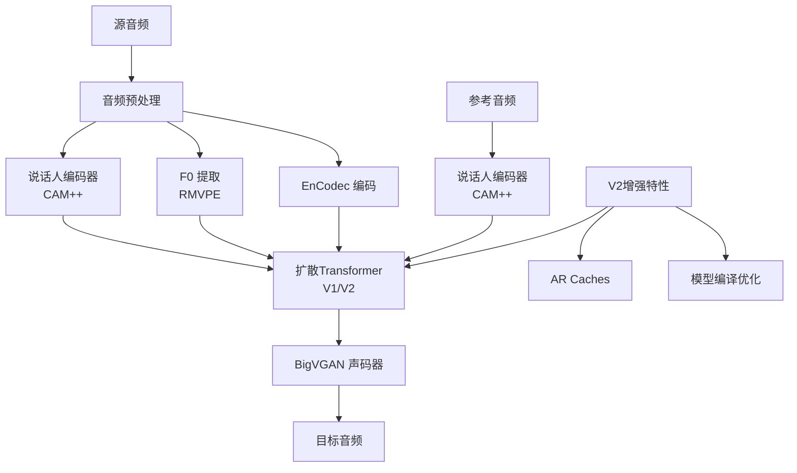

# Seed-VC 项目文档

## 项目概述

**Seed-VC** 是一个零样本文音转换系统，能够将源语音转换为目标说话人的声音。项目基于先进的深度学习技术，在语音转换的相似度和可懂度方面均超越了现有的开源基线模型。

### 核心特性

- **零样本学习**：无需目标说话人训练数据即可实现高质量语音转换
- **双版本支持**：提供 V1 和 V2 两个版本的模型架构
- **多场景适用**：支持语音转换和歌唱声音转换
- **优异性能**：在 SECS、WER、CER 等指标上显著优于 OpenVoice 和 CosyVoice

### 技术亮点

- 支持 CUDA、MPS 和 CPU 多设备推理
- 模型编译优化（torch.compile）
- 自适应 F0 调节
- 流式输出支持
- 多种基线模型对比（OpenVoice、CosyVoice、RVCv2）

---

## 🏗️ 架构总览

### 项目结构

```
seed-vc/
├── 📄 根级文件
│   ├── app.py              # V1版本 Gradio 应用入口
│   ├── app_vc.py           # V1版本语音转换应用
│   ├── app_svc.py          # V1版本歌唱声音转换应用
│   ├── app_vc_v2.py        # V2版本语音转换应用
│   ├── inference.py        # V1版本推理脚本
│   ├── inference_v2.py     # V2版本推理脚本
│   ├── eval.py             # 模型评估脚本
│   └── EVAL.md             # 评估结果和基准对比
│
├── 📁 核心模块 (modules/)
│   ├── astral_quantization/    # 量化模块
│   ├── bigvgan/               # BigVGAN 语音合成器
│   ├── campplus/              # CAM++ 说话人编码器
│   ├── hifigan/               # HiFi-GAN 声码器
│   ├── openvoice/             # OpenVoice 基线实现
│   ├── v2/                    # V2版本模型组件
│   ├── commons.py             # 通用工具函数
│   ├── audio.py               # 音频处理工具
│   ├── encodec.py             # EnCodec 音频编码器
│   ├── diffusion_transformer.py # 扩散Transformer
│   ├── flow_matching.py       # 流匹配模块
│   ├── length_regulator.py    # 长度调节器
│   ├── rmvpe.py               # RMVPE F0 提取
│   └── wavenet.py             # WaveNet 声码器
│
├── 📁 配置 (configs/)
│   ├── v2/                    # V2版本模型配置
│   ├── astral_quantization/   # 量化配置
│   ├── presets/               # 预置配置
│   ├── config.json            # 全局配置
│   └── hifigan.yml            # HiFi-GAN 配置
│
├── 📁 基线模型 (baselines/)
│   ├── openvoice.py           # OpenVoice 实现
│   ├── cosyvoice.py           # CosyVoice 实现
│   └── dnsmos/                # DNSMOS 评估工具
│
├── 📁 数据处理 (data/)
│   └── ft_dataset.py          # 微调数据集处理
│
├── 📁 检查点 (checkpoints/)
│   └── # 预训练模型权重
│
├── 📁 示例 (examples/)
│   ├── libritts-test-clean/   # LibriTTS 测试样本
│   ├── reference/             # 参考音频样本
│   ├── eval/                  # 评估结果输出
│   └── singing/               # 歌唱转换示例
│
└── 📁 资源 (assets/)
    └── # 静态资源文件
```

### Mermaid 架构图



---

## 📋 模块索引

### 核心模块 (modules/)

| 模块 | 功能 | 关键文件 | 依赖 |
|------|------|----------|------|
| **[astral_quantization](modules/astral_quantization/)** | 量化压缩 | bsq.py, convnext.py, transformer.py | PyTorch, NumPy |
| **[bigvgan](modules/bigvgan/)** | BigVGAN 声码器 | activations.py, alias_free_activation/ | PyTorch |
| **[campplus](modules/campplus/)** | CAM++ 说话人编码器 | # 多个实现文件 | PyTorch |
| **[commons](modules/commons.py)** | 通用工具 | commons.py | PyTorch, NumPy, munch |
| **[v2](modules/v2/)** | V2版本模型 | # V2专用组件 | Hydra, omegaconf |
| **[hifigan](modules/hifigan/)** | HiFi-GAN 声码器 | # 多个实现文件 | PyTorch |
| **[openvoice](modules/openvoice/)** | OpenVoice 基线 | # OpenVoice实现 | PyTorch |

### 应用层 (根目录)

| 文件 | 功能 | 版本 | 依赖 |
|------|------|------|------|
| **app.py** | Gradio Web UI | V1 | Gradio, PyTorch |
| **app_vc.py** | 语音转换界面 | V1 | Gradio, PyTorch |
| **app_svc.py** | 歌唱声音转换界面 | V1 | Gradio, PyTorch |
| **app_vc_v2.py** | V2版本语音转换界面 | V2 | Gradio, PyTorch |
| **inference.py** | 命令行推理 | V1 | PyTorch |
| **inference_v2.py** | V2版本命令行推理 | V2 | PyTorch, Hydra |

---

## 🔧 全局规范

### 代码风格

- **Python 版本**：Python 3.10+
- **依赖管理**：conda-nix-vc-py310.yaml
- **编码规范**：遵循 PEP 8
- **类型注解**：使用 Python 类型提示
- **设备支持**：自动检测 CUDA/MPS/CPU

### 配置管理

- 使用 Hydra 进行配置管理
- 支持动态配置加载
- 预置配置位于 `configs/presets/`
- 模型特定配置在独立目录

### 模型加载

```python
# V1 模型加载
from modules.commons import get_hparams_from_file
hparams = get_hparams_from_file("configs/v1/config.json")

# V2 模型加载
from hydra.utils import instantiate
from omegaconf import DictConfig
cfg = DictConfig(yaml.safe_load(open("configs/v2/vc_wrapper.yaml", "r")))
vc_wrapper = instantiate(cfg)
```

### 推理参数

| 参数 | 说明 | 默认值 | 范围 |
|------|------|--------|------|
| diffusion_steps | 扩散步数 | 10 | 1-100 |
| length_adjust | 长度调节 | 1.0 | 0.5-2.0 |
| inference_cfg_rate | 推理CFG率 | 0.7 | 0.0-1.0 |
| f0_condition | F0条件 | False | bool |
| auto_f0_adjust | 自动F0调节 | True | bool |

### 性能优化

- **模型编译**：使用 `torch.compile()` 优化推理
- **AR Caches**：支持自动回归缓存
- **半精度**：默认使用 FP16
- **批处理**：支持流式输出

### 评估指标

| 指标 | 全称 | 说明 | 目标 |
|------|------|------|------|
| SECS | 说话人嵌入余弦相似度 | 说话人相似度 | 越高越好 |
| WER | 词错误率 | 语音可懂度 | 越低越好 |
| CER | 字符错误率 | 语音可懂度 | 越低越好 |
| F0CORR | F0相关性 | 音高一致性 | 越高越好 |
| F0RMSE | F0均方根误差 | 音高准确性 | 越低越好 |
| SIG | 语音质量 | 音质评分 | 越高越好 |
| BAK | 背景噪声 | 噪声抑制 | 越高越好 |
| OVRL | 整体质量 | 综合评分 | 越高越好 |

---

## 🚀 快速开始

### 1. 环境准备

```bash
# 使用 conda 创建环境
conda env create -f conda-nix-vc-py310.yaml
conda activate vc
```

### 2. 运行 Web 应用

```bash
# V1 版本
python app.py

# V2 版本
python app_vc_v2.py
```

### 3. 命令行推理

```bash
# V1 版本
python inference.py \
    --source /path/to/source.wav \
    --target /path/to/reference.wav \
    --output output.wav \
    --diffusion-steps 10

# V2 版本
python inference_v2.py \
    --source /path/to/source.wav \
    --target /path/to/reference.wav \
    --output output.wav \
    --diffusion-steps 25
```

### 4. 评估测试

```bash
python eval.py \
    --source ./examples/libritts-test-clean \
    --target ./examples/reference \
    --output ./examples/eval/converted \
    --diffusion-steps 25 \
    --max-samples 100
```

---

## 📊 基准测试结果

### 语音转换 (LibriTTS)

| 模型 | SECS↑ | WER↓ | CER↓ | SIG↑ | BAK↑ | OVRL↑ |
|------|-------|------|------|------|------|-------|
| Ground Truth | 1.0000 | 8.02 | 1.57 | ~ | ~ | ~ |
| OpenVoice | 0.7547 | 15.46 | 4.73 | 3.56 | 4.02 | 3.27 |
| CosyVoice | 0.8440 | 18.98 | 7.29 | 3.51 | 4.02 | 3.21 |
| **Seed-VC (V2)** | **0.8676** | **11.99** | **2.92** | 3.42 | 3.97 | 3.11 |

### 歌唱声音转换 (M4Singer)

| 模型 | F0CORR↑ | F0RMSE↓ | SECS↑ | CER↓ | SIG↑ | BAK↑ | OVRL↑ |
|------|---------|---------|-------|------|------|------|-------|
| RVCv2 | 0.9404 | 30.43 | 0.7264 | 28.46 | **3.41** | **4.05** | **3.12** |
| **Seed-VC (V2)** | 0.9375 | 33.35 | **0.7405** | **19.70** | 3.39 | 3.96 | 3.06 |

---

## 📚 参考资料

- [Hydra 配置管理](https://hydra.cc/)
- [Gradio Web UI](https://gradio.app/)
- [BigVGAN 论文](https://arxiv.org/abs/2307.16669)
- [CAM++ 说话人编码器](https://github.com/yist-ai/campplus)
- [EnCodec 音频编码](https://github.com/facebookresearch/encodec)
- [LibriTTS 数据集](https://arxiv.org/abs/1904.03282)
- [M4Singer 歌唱数据集](https://github.com/M4Singer/M4Singer)

---

*此文档由 Claude Code 自动生成于 2025-10-28*
